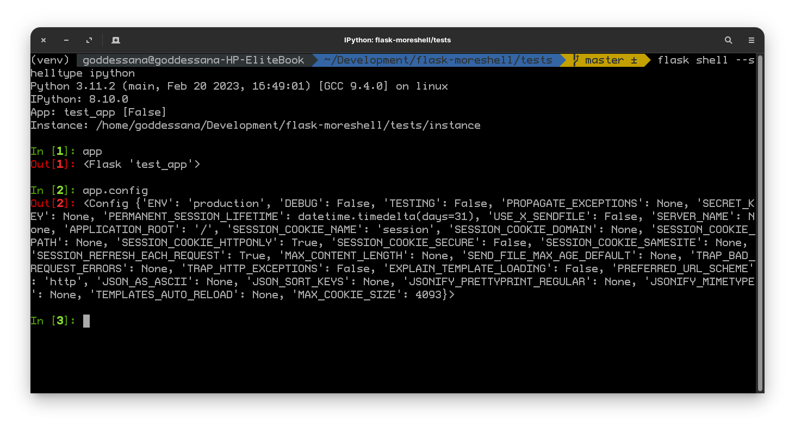
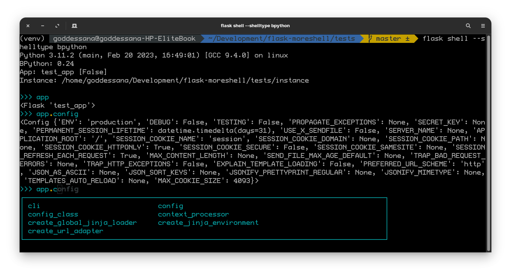
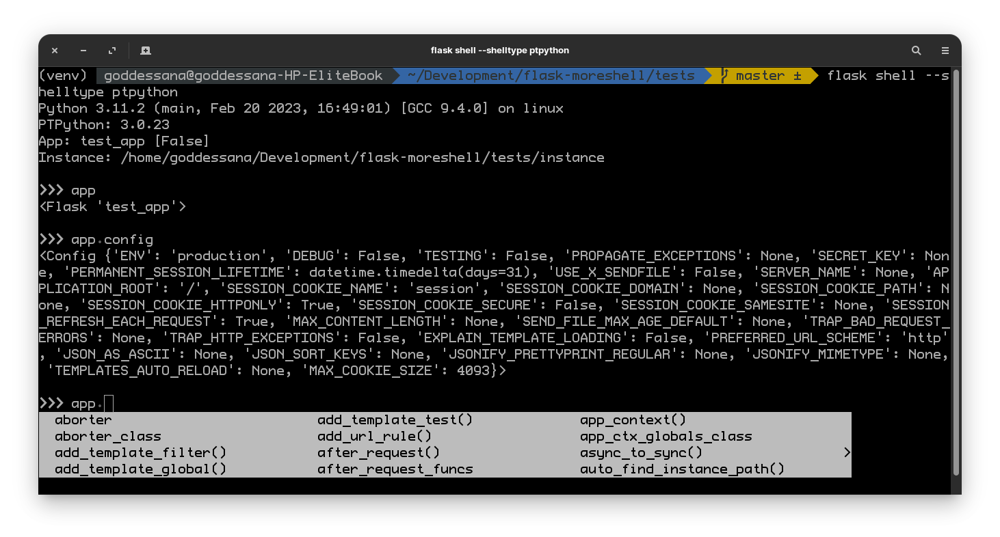

# Flask Moreshell

<p align="left">
  
</p>

[][pypi_]
[][status]
[][python version]
[][license]

[][read the docs]
[][tests]
[][codecov]

[][pre-commit]
[][black]

[pypi_]: https://pypi.org/project/flask-moreshell/
[status]: https://pypi.org/project/flask-moreshell/
[python version]: https://pypi.org/project/flask-moreshell
[read the docs]: https://flask-moreshell.readthedocs.io/
[tests]: https://github.com/tgoddessana/flask-moreshell/actions?workflow=Tests
[codecov]: https://app.codecov.io/gh/tgoddessana/flask-moreshell
[pre-commit]: https://github.com/pre-commit/pre-commit
[black]: https://github.com/psf/black

## Features

- TODO

## Requirements

- TODO

## Installation

You can install _Flask Moreshell_ via [pip] from [PyPI]:

```console
$ pip install flask-moreshell
```

## Usage

Please see the [Command-line Reference] for details.

## Usage

you can just use this command:

```shell
flask shell
```

and flask-moreshell tries to find this python REPL alternatives:

1. `ipython`
2. `bpython`
3. `ptpython`

if none of them are installed, just default python shell will be executed.

or you can choose specific shell type, via `--shelltype` option.
`ipython`, `bpython`, `ptpython` are supported.

ipython usage:

```shell
flask shell --shelltype ipython
```



bpython usage:

```shell
flask shell --shelltype bpython
```



ptpython usage:

```shell
flask shell --shelltype ptpython
```



## Contributing

Contributions are very welcome.
To learn more, see the [Contributor Guide].

## License

Distributed under the terms of the [MIT license][license],
_Flask Moreshell_ is free and open source software.

## Issues

If you encounter any problems,
please [file an issue] along with a detailed description.

[pypi]: https://pypi.org/å
[file an issue]: https://github.com/tgoddessana/flask-moreshell/issues
[pip]: https://pip.pypa.io/

<!-- github-only -->

[license]: https://github.com/tgoddessana/flask-moreshell/blob/main/LICENSE
[contributor guide]: https://github.com/tgoddessana/flask-moreshell/blob/main/CONTRIBUTING.md
[command-line reference]: https://flask-moreshell.readthedocs.io/en/latest/usage.html
