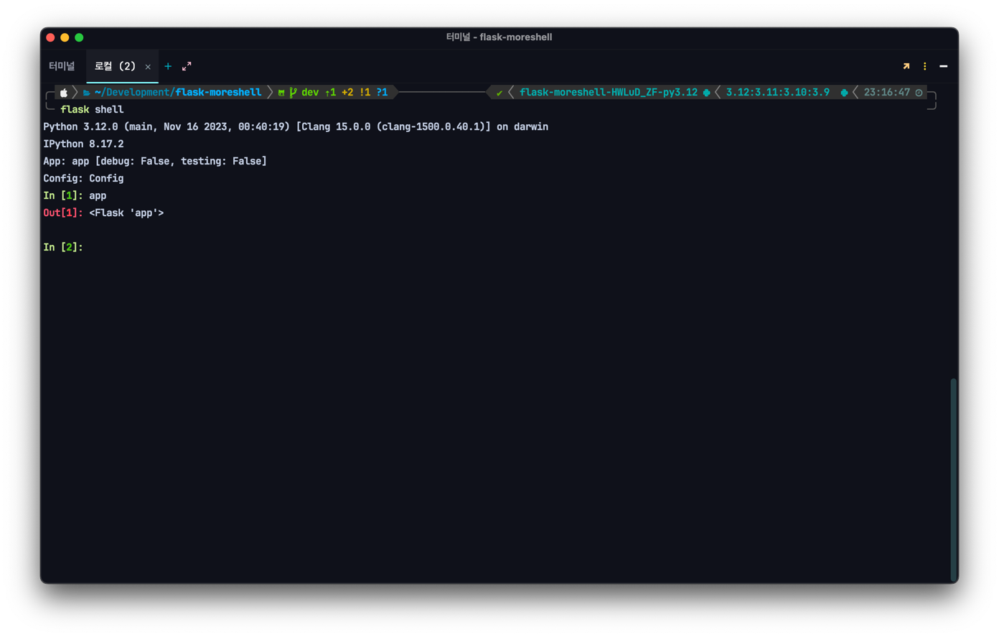
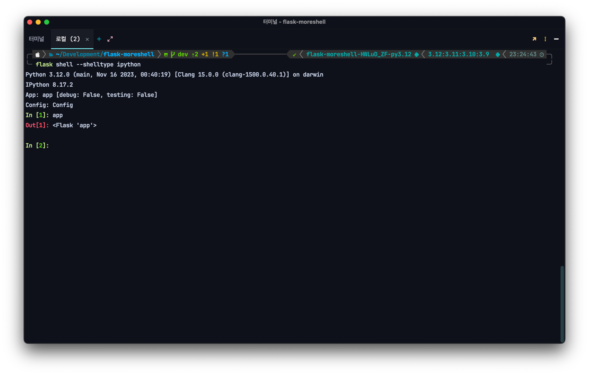
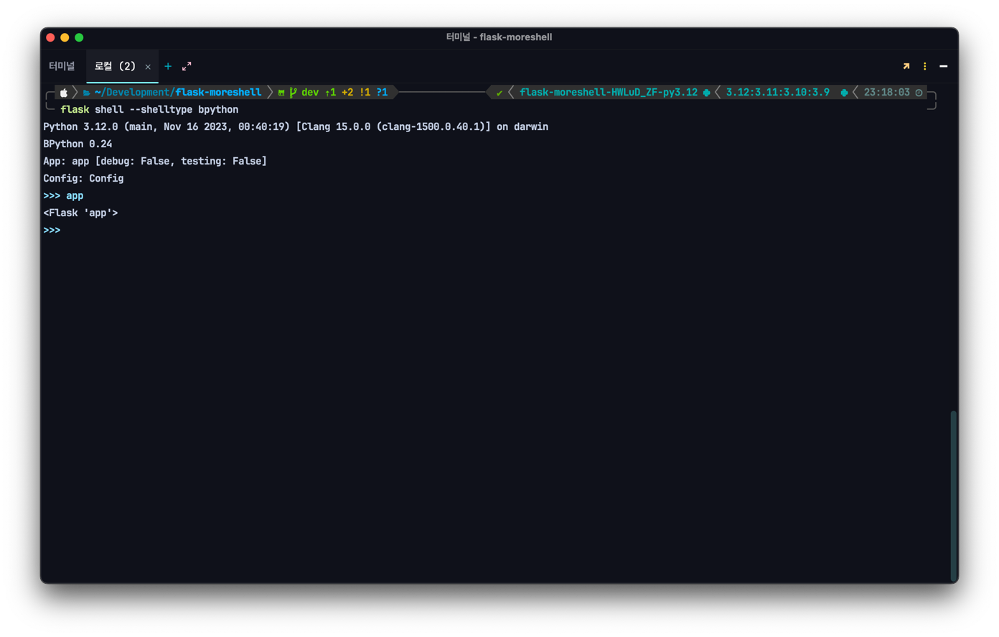
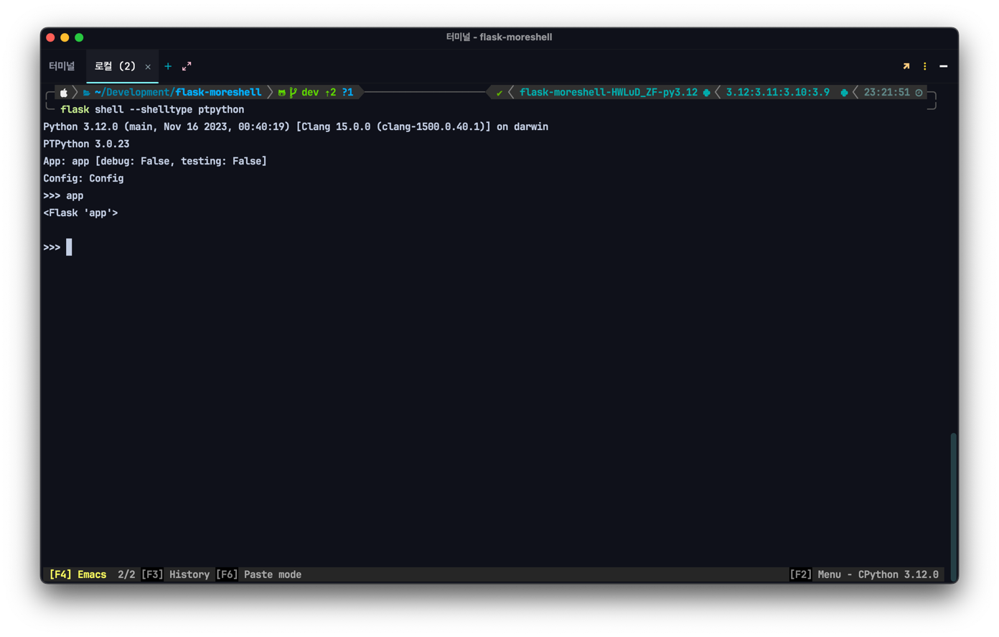

# Usage

```{eval-rst}
.. click:: flask_moreshell.__main__:main
    :prog: flask-moreshell
    :nested: full
```

after the package is installed, you can use the `flask shell` command as usual.

```console
$ flask shell
```

and you can see python REPLs like this, with flask app loaded.



By default, make sure that `ipython`, `bpython`, and `ptpython` are installed in your current virtual environment. When
you
use the `flask shell` command, the package will look for and load the Python REPLs in that order.

if no python REPL is found, the package will use the default python REPL.

if you want to use a specific shell, you can use the `--shelltype` option.

```shell
$ flask shell --shelltype bpython
```



```console
$ flask shell --shelltype bpython
```



```console
$ flask shell --shelltype ptpython
```



so that's all. enjoy, and go crush your flask bugs!
